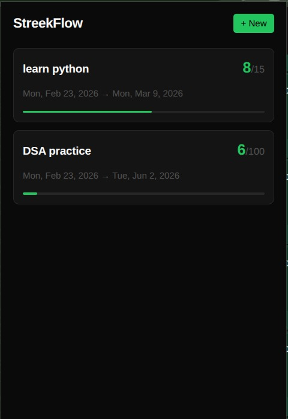
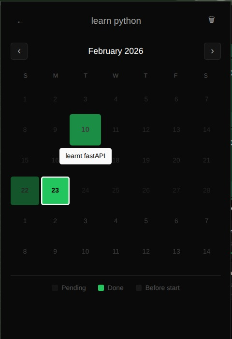
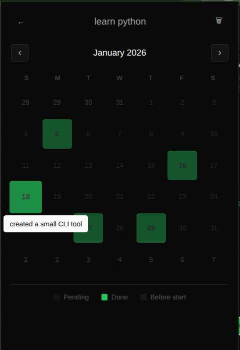
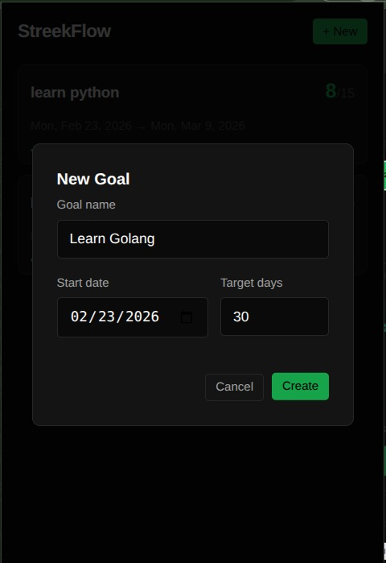
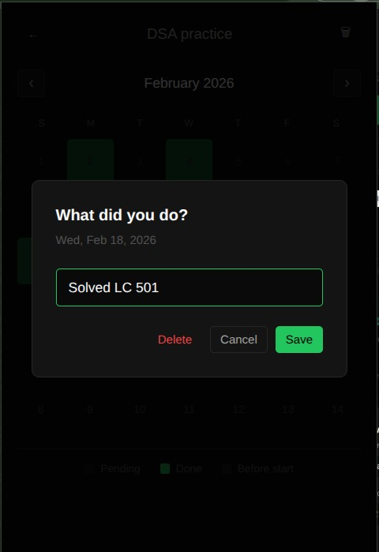
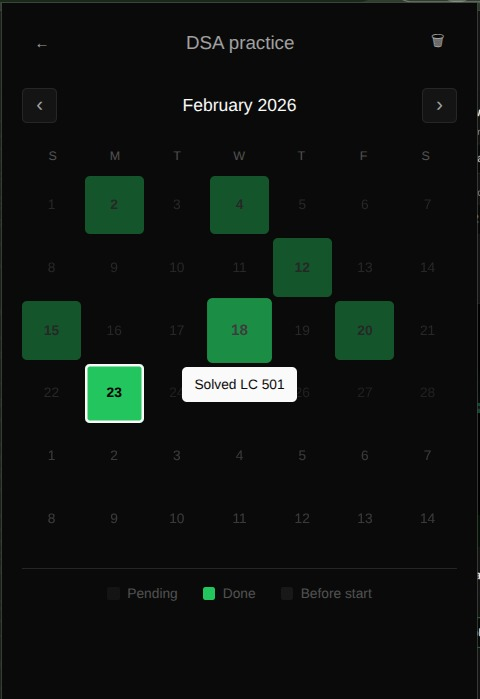

# StreekFlow

A Chrome extension to track your daily progress and build consistent habits.

## Features

- Track multiple goals simultaneously
- Set target days for each goal
- Visual calendar to mark completed days
- Add notes for each completed day
- See progress at a glance with completion percentage
- Retroactive entry - mark missed days from the past

## Screenshots








## Installation

### From Source

1. Clone this repository
2. Open Chrome and go to `chrome://extensions/`
3. Enable **Developer mode** (top right)
4. Click **Load unpacked**
5. Select the `streekflow` folder

### From GitHub Release

1. Download the latest release zip
2. Extract the zip
3. Open Chrome and go to `chrome://extensions/`
4. Enable **Developer mode**
5. Click **Load unpacked**
6. Select the extracted folder

## Usage

1. Click the extension icon to open
2. Click **+ New** to add a goal
3. Set the goal name, start date, and target days
4. Click on a goal to open the calendar
5. Click any day to mark it complete and add a note
6. Hover over completed days to see your notes

## Building from Source

If you want to modify the extension:

```bash
# The source files are in the root folder
# Copy to dist for testing:
cp -r popup manifest.json icons dist/
```

## License

MIT
